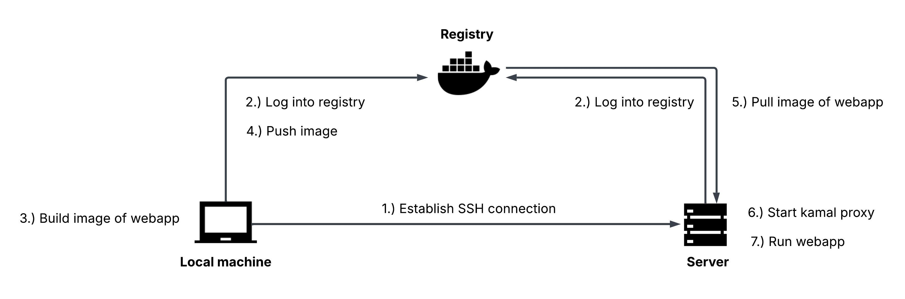

## What's Kamal?
A tool for deploying dockerized webapps. Although native to the Rails framework, Kamal works with any type of webapp.

Kamal aims to reduce the lock-in effect cloud providers built into their products. If you can SSH into a server, Kamal can deploy a webapp to the server.

**My goal was to become familiar with Kamal and to deploy a bare-bone Rails app. This is not a tutorial!**

## How does Kamal work?
Well, that's a vast question. While learning about Kamal, my single most used command was `kamal deploy`. Since this touches many relevant components, I want to roughly outline what happens during the deployment:

## Did it work out?
If [this page](https://shower-thoughts.net/up) is green, the Rails app was deployed succesfully.